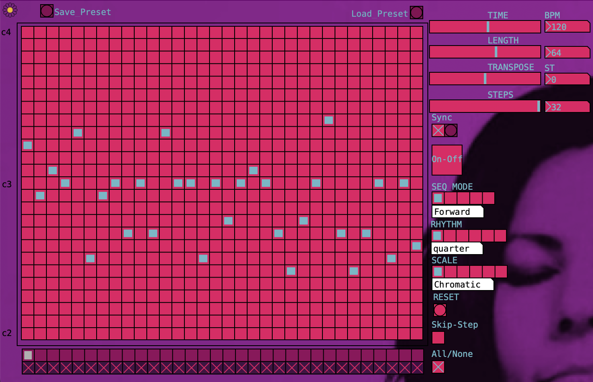

# VeraNois-StepSeq
16 / 32 Steps Sequencer.

&nbsp;

&nbsp;

## Features:
* VST plug-in
* 16 / 32 steps sequencer
* Free BPM or DAW sync
* Note length & Transpose controls
* 5 Sequence modes (Forward, Reverse, Alternate, Palindrome, Random)
* 6 music scales (Chromatic, Major, Minor, Major Pentatonic, Minor Pentatonic, Hexaphonic)
* Step skipping
* Clock devider

